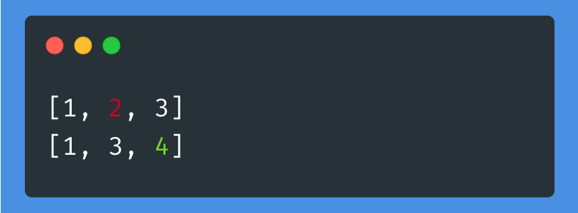

# SeqDiff - diff library for Rust and Python
[](https://crates.io/crates/seqdiff)
[](https://pypi.org/project/pyseqdiff/)
[](https://github.com/tamuhey/seqdiff/actions)

`diff` based on Myers' algorithm.



# Usage

## Python

### `diff`


```python
def diff(
    a: Sequence[S], b: Sequence[T], *, key: Optional[Callable[[S, T], bool]] = None
) -> Tuple[List[Optional[int]], List[Optional[int]]]: ...
```

Returns the correspondence between two sequences `a` and `b`.
`key` is a comparison function (if needed).

```python
import seqdiff

a = [1, 2, 3]
b = [1, 3, 4]
a2b, b2a = seqdiff.diff(a, b)
assert all(a[i] == b[j] for i, j in enumerate(a2b) if j is not None)
assert all(a[j] == b[i] for i, j in enumerate(b2a) if j is not None)
print(a2b)
print(b2a)
```

```
[0, None, 1]
[0, 2, None]
```

### `print_diff`

```python
def print_diff(
    a: Sequence[S], b: Sequence[T], *, key: Optional[Callable[[S, T], bool]] = None
): ...
```

Pretty print the diff between two sequences `a` and `b`.  
`key` is a comparison function (if needed).

```python
import seqdiff

a = [1, 2, 3]
b = [1, 3, 4]
a2b, b2a = seqdiff.print_diff(a, b)
```

The return value is a pair of tuples. The first tuple contains the index where the item from the first sequence appears in the 2nd sequence or `None` if the item doesn't appear in the 2nd sequence. The 2nd tuple is the same but listing the corresponding indexes for the 2nd sequence in the first sequence.


## Rust

```rust
use seqdiff;

let (a2b, b2a) = seqdiff::diff(&[1, 2, 3], &[1, 3]);
assert_eq!(a2b, vec![Some(0), None, Some(1)]);
assert_eq!(b2a, vec![Some(0), Some(2)]);
```

See the [doc](https://docs.rs/seqdiff) for more info.

# Related

- [tokenizations - Robust and Fast tokenizations alignment library for Rust and Python](https://github.com/tamuhey/tokenizations)
    - This library depends on `seqdiff`
